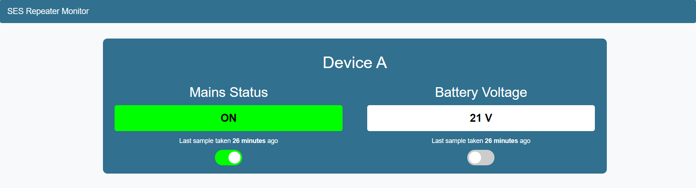
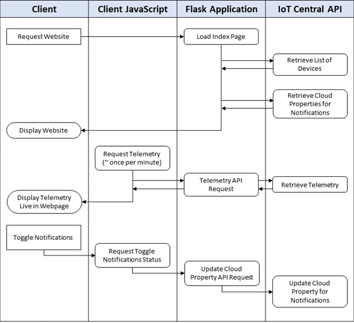

# Repeater Monitor Web Application
## Background
An IoT device has been created to monitor the 240V AC normal supply, and 12V DC battery back-up supply for a radio repeater. The purpose of this web application is to allow SES CSU field operators to:
* View a list of deployed devices
* View the telemetry (mains and battery status) most recently reported from the device, and the time it was reported
* Disable/enable associated SMS notifications

## Authors
Created by:
* **Rio Akbar** (22507035)
* **Calvin Nguyen** (22509815)
* **Erik Stefan** (22224939)
* **James Tarrant** (20924309)
* **Dylan Turner** (22240231)

Developed for use in CITS3200, on behalf of SES CSU. 
[The full git repository can be found here.](https://github.com/tarrantja/remote-monitor-web)

## Pages & Interactions
### Home Page (Index)
* [ DEVICES ] A list of devices is pulled from IoT Central and dynamically displayed.  
* [ TELEMETRY ] Javascript is used to fetch the telemetry for each device via the flask app, and display it within the page.
* [ NOTIFICATIONS ] Toggle switches are provided to disable SMS notifications for each device, and each telemetry type.

## Architecture
* Web application framework: **flask**
* Templating language: **jinja2**
* Deployed: Azure App Service

The application architecture is shown in the image below:

## How to Launch
### Local Host
1. Clone repository https://github.com/tarrantja/remote-monitor-web from github
2.  `cd remote-monitor-web`
3. Create virtual environmnent `python3 -m venv venv`
4. Enter virtual environment `source venv/bin/activate` (or for Windows `venv\Scripts\activate`)
NOTE: If you recieve a 'running scripts is disabled error' on Windows, try running `Set-ExecutionPolicy RemoteSigned` first. 
5. Install required packages `pip install -r requirements.txt`
6. `export AZURE_TOKEN="<enter token>"`(for mac/linux)
8. `setx AZURE_TOKEN "<enter token>"` (for windows)
10. `flask run`
11. Go to http://localhost:5000/
12. To exit use Ctrl+C or control+C

### Production Deployment
1. Ensure the changes are functional in localhost before deploying.
2. Push or merge changes with the main branch.
3. Azure App Service will automatically deploy the new changes.

## Licence
This work is licensed under the Creative Commons Attribution-NonCommercial 3.0 Australia License. 

This work was created with the assistance of the [Miguel Grinberg Microblog Mega-Tutorial](https://blog.miguelgrinberg.com/post/the-flask-mega-tutorial-part-i-hello-world).
